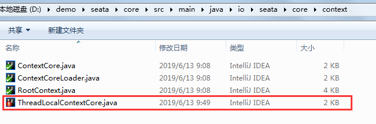

# demo-seata-springcloud
springboot + springcloud + feign + seata + mybatis + mysql

# 项目结构
> 本项目分为三层
* web层
* 业务层
* 基础服务层

> web层为：seata-springcloud-web  
> 业务层为：seata-springcloud-business  
> 基础服务层： seata-springcloud-account、seata-springcloud-order、seata-springcloud-storage  

# 数据库
```sql
CREATE TABLE `BUSINESS_ACCOUNT` (
  `accountId` varchar(32) NOT NULL COMMENT '主键uuid',
  `amount` decimal(18,6) DEFAULT NULL COMMENT '金额',
  `accountName` varchar(32) DEFAULT NULL COMMENT '账户名称',
  `logicDel` char(1) DEFAULT NULL COMMENT '逻辑删除 Y:删除 N:未删除',
  `remark` varchar(240) DEFAULT NULL COMMENT '备注',
  PRIMARY KEY (`accountId`)
) ENGINE=InnoDB DEFAULT CHARSET=utf8

CREATE TABLE `BUSINESS_ORDER` (
  `orderId` varchar(32) NOT NULL COMMENT '主键uuid',
  `orderNo` varchar(32) DEFAULT NULL COMMENT '订单号',
  `orderDetail` varchar(240) DEFAULT NULL COMMENT '订单详情',
  `createTime` varchar(24) DEFAULT NULL COMMENT '创建时间',
  `logicDel` char(1) DEFAULT NULL COMMENT '逻辑删除 Y:删除 N:未删除',
  `remark` varchar(240) DEFAULT NULL COMMENT '备注',
  PRIMARY KEY (`orderId`),
  UNIQUE KEY `orderNo` (`orderNo`)
) ENGINE=InnoDB DEFAULT CHARSET=utf8

CREATE TABLE `BUSINESS_STORAGE` (
  `storageId` varchar(32) NOT NULL COMMENT '主键uuid',
  `storageName` varchar(32) DEFAULT NULL COMMENT '仓储名称',
  `storageCount` int(11) DEFAULT NULL COMMENT '数量',
  `logicDel` char(1) DEFAULT NULL COMMENT '逻辑删除 Y:删除 N:未删除',
  `remark` varchar(240) DEFAULT NULL COMMENT '备注',
  PRIMARY KEY (`storageId`)
) ENGINE=InnoDB DEFAULT CHARSET=utf8

#这个表是seata在at模式下需要的表
CREATE TABLE `undo_log` (
  `id` bigint(20) NOT NULL AUTO_INCREMENT,
  `branch_id` bigint(20) NOT NULL,
  `xid` varchar(100) NOT NULL,
  `rollback_info` longblob NOT NULL,
  `log_status` int(11) NOT NULL,
  `log_created` datetime NOT NULL,
  `log_modified` datetime NOT NULL,
  `ext` varchar(100) DEFAULT NULL,
  PRIMARY KEY (`id`),
  KEY `idx_unionkey` (`xid`,`branch_id`)
) ENGINE=InnoDB AUTO_INCREMENT=171 DEFAULT CHARSET=utf8
```

# 整合过程
> 因为官方只支持dubbo，所有需要自己想办法处理

## 1.业务层(business)
> 1.需要在business层加上该拦截器设置xid

```java
import org.apache.commons.lang3.StringUtils;
import org.springframework.stereotype.Component;

import com.sly.seata.common.constant.SeataConstant;

import feign.RequestInterceptor;
import feign.RequestTemplate;
import io.seata.core.context.RootContext;

/**
 * Feign拦截器，把RootContext中的XID（XID用于标识一个局部事务属于哪个全局事务，需要在调用链路的上下文中传递）传递到上层调用链路
 * 
 * @author sly
 * @time 2019年6月12日
 */
@Component
public class RequestHeaderInterceptor implements RequestInterceptor {

	@Override
	public void apply(RequestTemplate template) {
		String xid = RootContext.getXID();
		if (StringUtils.isNotBlank(xid)) {
			template.header(SeataConstant.XID_HEADER, xid);
		}
	}

}
```

> 2.要在business层加上配置

```java
import org.springframework.context.annotation.Bean;
import org.springframework.context.annotation.Configuration;

import io.seata.spring.annotation.GlobalTransactionScanner;

/**
 * seata配置
 * 
 * @author sly
 * @time 2019年6月11日
 */
@Configuration
public class SeataAutoConfig {

	/**
	 * 初始化全局事务扫描
	 * 
	 * @return
	 * @author sly
	 * @time 2019年6月11日
	 */
	@Bean
	public GlobalTransactionScanner globalTransactionScanner() {
		return new GlobalTransactionScanner("seata-springcloud-business", "my_test_tx_group");
	}
}
```

> 3.加上配置文件file.conf和registry.conf

## 2.基础服务层
> 1.加上过滤器用来获取xid

```java
import java.io.IOException;

import javax.servlet.FilterChain;
import javax.servlet.ServletException;
import javax.servlet.http.HttpServletRequest;
import javax.servlet.http.HttpServletResponse;

import org.apache.commons.lang3.StringUtils;
import org.slf4j.Logger;
import org.slf4j.LoggerFactory;
import org.springframework.web.filter.OncePerRequestFilter;

import com.sly.seata.common.constant.SeataConstant;

import io.seata.core.context.RootContext;

/**
 * Http Rest请求拦截器，用于把当前上下文中获取到的XID放到RootContext
 * @author sly
 * @time 2019年6月12日
 */
public class SeataXidFilter extends OncePerRequestFilter {
	protected Logger logger = LoggerFactory.getLogger(SeataXidFilter.class);

	@Override
	protected void doFilterInternal(HttpServletRequest request, HttpServletResponse response, FilterChain filterChain)
			throws ServletException, IOException {
		String xid = RootContext.getXID();
		String restXid = request.getHeader(SeataConstant.XID_HEADER);
		boolean bind = false;
		if (StringUtils.isBlank(xid) && StringUtils.isNotBlank(restXid)) {
			RootContext.bind(restXid);
			bind = true;
			if (logger.isDebugEnabled()) {
				logger.debug("bind[" + restXid + "] to RootContext");
			}
		}
		try {
			filterChain.doFilter(request, response);
		} finally {
			if (bind) {
				String unbindXid = RootContext.unbind();
				if (logger.isDebugEnabled()) {
					logger.debug("unbind[" + unbindXid + "] from RootContext");
				}
				if (!restXid.equalsIgnoreCase(unbindXid)) {
					logger.warn("xid in change during http rest from " + restXid + " to " + unbindXid);
					if (unbindXid != null) {
						RootContext.bind(unbindXid);
						logger.warn("bind [" + unbindXid + "] back to RootContext");
					}
				}
			}
		}

	}

}
```

> 2.配置seata

```java
import org.apache.ibatis.session.SqlSessionFactory;
import org.apache.ibatis.transaction.jdbc.JdbcTransactionFactory;
import org.mybatis.spring.SqlSessionFactoryBean;
import org.springframework.beans.factory.annotation.Autowired;
import org.springframework.boot.autoconfigure.jdbc.DataSourceProperties;
import org.springframework.context.annotation.Bean;
import org.springframework.context.annotation.Configuration;
import org.springframework.context.annotation.Primary;
import org.springframework.core.io.support.PathMatchingResourcePatternResolver;

import com.alibaba.druid.pool.DruidDataSource;
import com.sly.seata.order.filter.SeataXidFilter;

import io.seata.rm.datasource.DataSourceProxy;
import io.seata.spring.annotation.GlobalTransactionScanner;

/**
 * seata配置
 * 
 * @author sly
 * @time 2019年6月11日
 */
@Configuration
public class SeataAutoConfig {
	@Autowired
	private DataSourceProperties dataSourceProperties;

	/**
	 * druid数据源
	 * 
	 * @return
	 * @author sly
	 * @time 2019年6月11日
	 */
	@Bean
	@Primary
	public DruidDataSource druidDataSource() {
		DruidDataSource druidDataSource = new DruidDataSource();
		druidDataSource.setUrl(dataSourceProperties.getUrl());
		druidDataSource.setUsername(dataSourceProperties.getUsername());
		druidDataSource.setPassword(dataSourceProperties.getPassword());
		druidDataSource.setDriverClassName(dataSourceProperties.getDriverClassName());
		druidDataSource.setInitialSize(0);
		druidDataSource.setMaxActive(180);
		druidDataSource.setMaxWait(60000);
		druidDataSource.setMinIdle(0);
		// druidDataSource.setValidationQuery("Select 1 from DUAL");
		druidDataSource.setTestOnBorrow(false);
		druidDataSource.setTestOnReturn(false);
		druidDataSource.setTestWhileIdle(true);
		druidDataSource.setTimeBetweenEvictionRunsMillis(60000);
		druidDataSource.setMinEvictableIdleTimeMillis(25200000);
		druidDataSource.setRemoveAbandoned(true);
		druidDataSource.setRemoveAbandonedTimeout(1800);
		druidDataSource.setLogAbandoned(true);
		return druidDataSource;
	}

	/**
	 * 代理数据源
	 * 
	 * @param druidDataSource
	 * @return
	 * @author sly
	 * @time 2019年6月11日
	 */
	@Bean
	public DataSourceProxy dataSourceProxy(DruidDataSource druidDataSource) {
		return new DataSourceProxy(druidDataSource);
	}

	/**
	 * 初始化mybatis sqlSessionFactory
	 * 
	 * @param dataSourceProxy
	 * @return
	 * @throws Exception
	 * @author sly
	 * @time 2019年6月11日
	 */
	@Bean
	public SqlSessionFactory sqlSessionFactory(DataSourceProxy dataSourceProxy) throws Exception {
		SqlSessionFactoryBean factoryBean = new SqlSessionFactoryBean();
		factoryBean.setDataSource(dataSourceProxy);
		factoryBean.setMapperLocations(new PathMatchingResourcePatternResolver().getResources("classpath:mapper/*.xml"));
		factoryBean.setTypeAliasesPackage("com.sly.seata.common.model");
		factoryBean.setTransactionFactory(new JdbcTransactionFactory());
		return factoryBean.getObject();
	}
	
	/**
	 * 初始化seataXid过滤器
	 * 
	 * @return
	 * @author sly
	 * @time 2019年6月12日
	 */
	@Bean
	public SeataXidFilter fescarXidFilter() {
		return new SeataXidFilter();
	}

	/**
	 * 初始化全局事务扫描
	 * 
	 * @return
	 * @author sly
	 * @time 2019年6月11日
	 */
	@Bean
	public GlobalTransactionScanner globalTransactionScanner() {
		return new GlobalTransactionScanner("seata-springcloud-order", "my_test_tx_group");
	}
}
```

## 修改seata源码
> 下载源码将core中的ThreadLocalContextCore.java修改：



```java
@LoadLevel(name = "ThreadLocalContextCore", order = Integer.MIN_VALUE)
public class ThreadLocalContextCore implements ContextCore {

    private ThreadLocal<Map<String, String>> threadLocal = new InheritableThreadLocal<Map<String, String>>() {
        @Override
        protected Map<String, String> initialValue() {
            return new HashMap<String, String>();
        }

    };

    @Override
    public String put(String key, String value) {
        return threadLocal.get().put(key, value);
    }

    @Override
    public String get(String key) {
        return threadLocal.get().get(key);
    }

    @Override
    public String remove(String key) {
        return threadLocal.get().remove(key);
    }
}
```

> [为什么要修改](https://github.com/seata/seata/issues/883)

# 使用
> 首先你需要启动seata-service  
> [下载地址](https://github.com/seata/seata/releases)  
> 如果使用熔断记得手动抛出异常，不然seata就会认为你是操作成功了。feign调用我觉得坑爹之处就在这，我其实不是很喜欢feign。但是公司要用也没办法。

```java
import java.math.BigDecimal;
import java.util.Date;
import java.util.HashMap;
import java.util.Map;

import org.apache.commons.lang3.exception.ExceptionUtils;
import org.slf4j.Logger;
import org.slf4j.LoggerFactory;
import org.springframework.beans.factory.annotation.Autowired;
import org.springframework.web.bind.annotation.RequestParam;
import org.springframework.web.bind.annotation.RestController;

import com.sly.seata.account.service.AccountService;
import com.sly.seata.business.service.BusinessService;
import com.sly.seata.common.model.account.Account;
import com.sly.seata.common.model.order.Order;
import com.sly.seata.common.model.storage.Storage;
import com.sly.seata.common.utils.CommonUtils;
import com.sly.seata.common.utils.DateUtils;
import com.sly.seata.order.service.OrderService;
import com.sly.seata.storage.service.StorageService;

import io.seata.core.context.RootContext;
import io.seata.spring.annotation.GlobalTransactional;

/**
 * 业务service实现
 * 
 * @author sly
 * @time 2019年6月12日
 */
@RestController
public class BusinessServiceImpl implements BusinessService {
	private static final Logger LOGGER = LoggerFactory.getLogger(BusinessService.class);

	@Autowired
	private AccountService accountService;
	@Autowired
	private OrderService orderService;
	@Autowired
	private StorageService storageService;

	/**
	 * 付款
	 * 
	 * @param accountId
	 * @param orderId
	 * @param storageId
	 * @return
	 * @author sly
	 * @time 2019年6月12日
	 */
	@GlobalTransactional
	@Override
	public Map<String, Object> purchase(@RequestParam("accountId") String accountId,
			@RequestParam("orderId") String orderId, @RequestParam("storageId") String storageId) {
		try {
			System.out.println("accountId:" + accountId);
			System.out.println("orderId" + orderId);
			System.out.println("storageId" + storageId);

			Storage storage = new Storage();
			storage.setStorageId(CommonUtils.genUUID());
			storage.setStorageName("name");
			storage.setStorageCount(20);
			storage.setRemark("备注");
			storage.setLogicDel("N");
			Order order = new Order();
			order.setOrderId(CommonUtils.genUUID());
			order.setOrderNo("NO" + System.currentTimeMillis());
			order.setOrderDetail("详情");
			order.setCreateTime(DateUtils.formateTime(new Date()));
			order.setRemark("备注");
			order.setLogicDel("N");
			Account account = new Account();
			account.setAccountId(CommonUtils.genUUID());
			account.setAccountName("name");
			account.setAmount(new BigDecimal("100.5"));
			account.setLogicDel("N");
			account.setRemark("备注");
			
			System.out.println("xid" + RootContext.getXID());
			
			Map<String, Object> insert = storageService.insert(storage);
			if((int)insert.get("status") != 200) {
				throw new RuntimeException((String)insert.get("message"));
			}
			Map<String, Object> insert2 = orderService.insert(order);
			if((int)insert2.get("status") != 200) {
				throw new RuntimeException((String)insert2.get("message"));
			}
			Map<String, Object> insert3 = accountService.insert(account);
			if((int)insert3.get("status") != 200) {
				throw new RuntimeException((String)insert3.get("message"));
			}

			Map<String, Object> result = new HashMap<>(16);
			result.put("status", 200);
			result.put("message", "付款成功！");
			return result;
		} catch (Exception e) {
			LOGGER.error(ExceptionUtils.getStackTrace(e));
			throw new RuntimeException(e);
		}
	}

}
```

